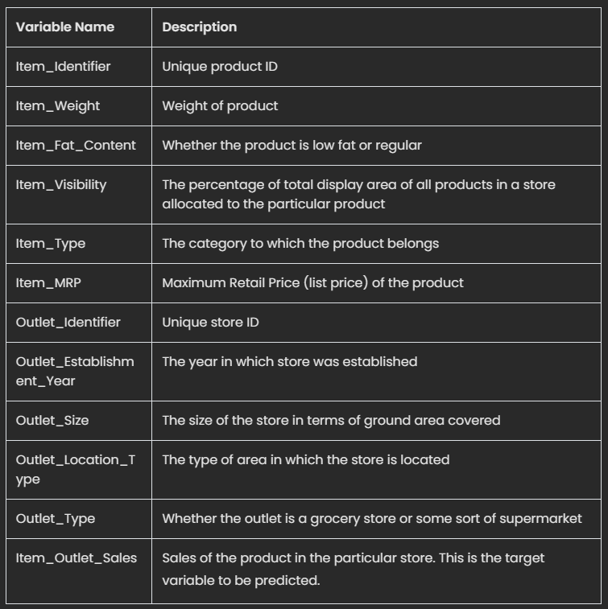
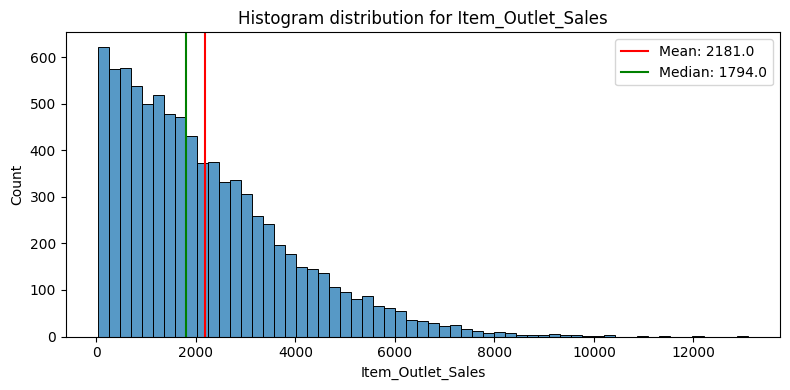
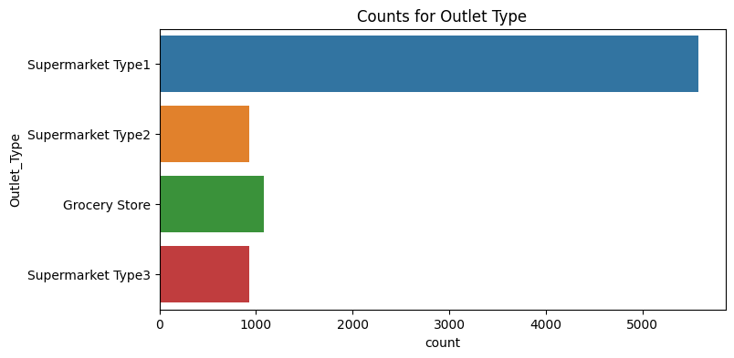
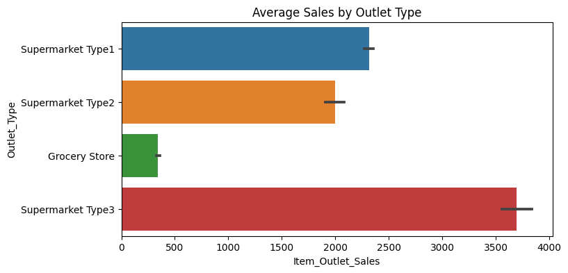
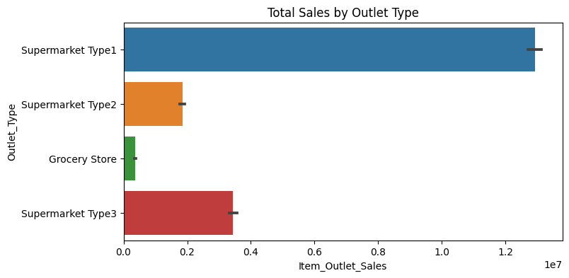

# Sales by Item and Outlet
## Using Python to predict item sales by outlet
Raymond Garcia

### A key to running a business is understanding your sales, and knowing how to forecast those sales. In this analysis, I will attempt to forecast Item Sales by Outlet, given information on the item and the outlet.

## Data Source:
Big Mart Sales Data: https://datahack.analyticsvidhya.com/contest/practice-problem-big-mart-sales-iii/

The dataset included ```8,523``` rows and ```12``` columns.

## Data Dictionary



## Methods
---
I first started with data cleaning, Exploratory Data Analysis, Explanatory Data Analysis, and then Modeling

### Exploratory Data Analysis

```
* A Correlation heatmap was drawn to understand the relationship between the numerical features. 
* Histograms and Boxplots were also drawn on the numerical columns, while Bar Charts were drawn for the categorical data.
* The distribution of our target has positive skew.
* Most Outlets are Supermarket Type1.
```


* Histogram showing that the Item_Outlet_Sales data has positive skew, with the median below the mean.



* Barchart showing that most item sales are from Supermarket Type1.

### Explanatory Data Analysis

```
* Graphs comparing categorical and numerical data to the target were drawn
* It was found that Supermarket Type3 had the highest average Item Outlet Sales
* Grocery Store had the lowest average Item Outlet Sales
```

* Barchart showing that Supermarket Type3 has the highest average sales.


* Supermarket Type1 has the most in total item sales.

### Machine Learning Modeling

```
The following models were built and optimized in the notebook:
* Linear Regression
* Decision Tree
* Random Forest
```
## Model Evaluation
---
__All metrics shown below are using the final tuned model, and were calculated on the testing dataset.__
* Linear Regression Model
    * MAE: ```805.39```
    * RMSE: ```1,094.45```
    * R2: ```56.58```

* Decision Tree Model
    * MAE: ```738.32```
    * RMSE: ```1,057.44```
    * R2: ```59.47```

* Random Forest Model
    * MAE: ```728.33```
    * RMSE: ```1,046.64```
    * R2: ```60.30```

* Ultimately, the best model was the tuned Random Forest Model.
    * n_estimators tuned to ```150```.
    * max_depth tuned to ```5```.
    * The model explains ```60.3%``` of the variance in the target, with the chosen features.
    * The model has a Mean Absolute Error(MAE) of ```728.33```.
    * The model has a Root Mean Squared Error of ```1,046.64```.

## Final Recommendations
### Insights
* Supermarket Type3 is the best performing supermarket type. 
* Grocery stores perform the worst. 
* It might be useful to segment the data by Outlet_Type and run separate models for each.

### Model Recommendation
* Overall, the best fit model was Random Forest. It has some bias, but it was the best performer.